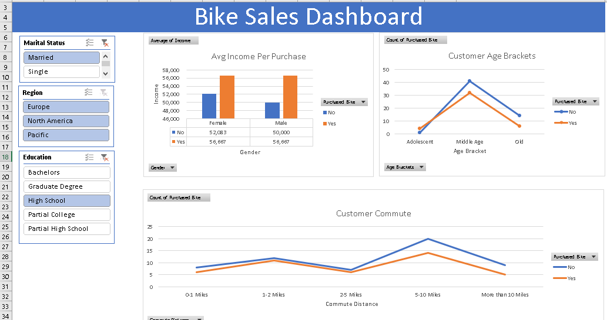

# 📊 Excel Bike Sales Data Analysis Project

This is a comprehensive **data analytics case study** performed using Microsoft Excel. It involves cleaning, analyzing, and visualizing customer data to identify insights into **bike purchase behavior**.

---

## ✅ Project Objectives

- Clean and format raw customer data
- Explore how demographic and commute factors impact bike purchases
- Create meaningful pivot tables and visualizations
- Build a professional and interactive Excel dashboard
- Derive actionable insights for business decisions

---

## 📁 Project Structure

```

📂 1_EXCEL-PROJECT/
│
├── 📄 Bike_Sales_Analysis.xlsx     # Main Excel workbook with all sheets and dashboard
├── 📄 README.md                    # README file
├── 🖼️ dash.png                     # Dashboard image (used in README)
├── 📂 data/
│   └── 📄 bike_buyers.xlsx         # Raw dataset used for the project


```

---

## 📌 Dataset Overview

The dataset includes information on customers such as:

- **Customer ID**
- **Gender**
- **Marital Status**
- **Age**
- **Income**
- **Children**
- **Education**
- **Occupation**
- **Commute Distance**
- **Region**
- **Bike Buyer** (Yes/No)

---

## 🛠️ Tools Used

- **Microsoft Excel** (Excel 2016 or newer recommended)
- **Pivot Tables** and **Pivot Charts**
- **Slicers** for interactivity
- **Excel Functions**: `IF`, `AND`, `OR`, `CLEAN`, etc.

---

## 🧹 Data Cleaning & Preparation

Steps included:
- Removing duplicates
- Formatting columns (e.g. income to currency)
- Standardizing text values (e.g. "M" to "Married")
- Creating age groups and categories
- Creating a clean working sheet separate from raw data

---

## 📊 Data Analysis with Pivot Tables

### 1. 🚻 Gender Distribution of Bike Buyers

| Gender | Avg Income (Non-Buyers) | Avg Income (Buyers) |
|--------|--------------------------|----------------------|
| Female | 52,083                   | 56,667               |
| Male   | 50,000                   | 56,667               |

> ✅ **Insight**: Both male and female bike buyers earn more than non-buyers. Gender alone doesn’t significantly affect purchase decisions.

---

### 2. 💰 Impact of Income on Bike Purchases

- **Buyers Average Income**: 56,667  
- **Non-Buyers Average Income**: 50,893

> ✅ **Insight**: Higher income strongly correlates with likelihood of purchasing a bike.

---

### 3. 🧭 Commute Distance vs Bike Buyers

| Commute Distance | Buyers | Non-Buyers |
|------------------|--------|------------|
| 0–1 Miles        | 6      | 8          |
| 1–2 Miles        | 11     | 12         |
| 2–5 Miles        | 6      | 7          |
| 5–10 Miles       | 14     | 20         |
| >10 Miles        | 5      | 9          |

> ✅ **Insight**: People who commute **5–10 miles** are the most frequent bike buyers. Longer commutes reduce purchase probability.

---

### 4. 👥 Age Groups & Purchase Behavior

| Age Group  | Buyers | Non-Buyers |
|------------|--------|------------|
| Adolescent | 4      | 1          |
| Middle Age | 32     | 41         |
| Old        | 6      | 14         |

> ✅ **Insight**: Middle-aged customers dominate the dataset, but adolescents have the **highest bike purchase percentage** (80%).

---

### 🎯 Ideal Buyer Profile

Based on all pivot table insights:
- **Age**: Middle-aged
- **Income**: 56,667+
- **Commute**: 5–10 miles
- **Gender**: Either (not a strong factor)
- **Marital Status**: Married (optional further analysis)

> 📌 **Recommendation**: Focus marketing efforts on middle-aged professionals with decent income and moderate commutes.

---

## 📈 Dashboard

The Excel file includes a polished dashboard with:
- Interactive **slicers**
- Visuals (bar, pie, and column charts)
- Clean layout for presentations or stakeholders

> 📁 Dashboard is in the final sheet: `Dashboard`


---

## 🚀 How to Use

1. Clone or download this repository
2. Open `Bike_Sales_Analysis.xlsx` in Microsoft Excel
3. Explore each tab (Raw Data, Cleaned Data, Pivot Tables, Dashboard)
4. Use slicers on the Dashboard to filter by Gender, Age Group, and Commute Distance

---

## 📜 License

This project is for educational and portfolio purposes.  
You are free to reuse and modify it with credit.

---

## 🙌 Let's Connect

- GitHub: [Asantesana45](https://github.com/Asantesana45?tab=repositories)
- Email: [johnsonmunisi2021@gmail.com]

---

> ⭐ If you found this helpful, give it a star and share it with other learners!


